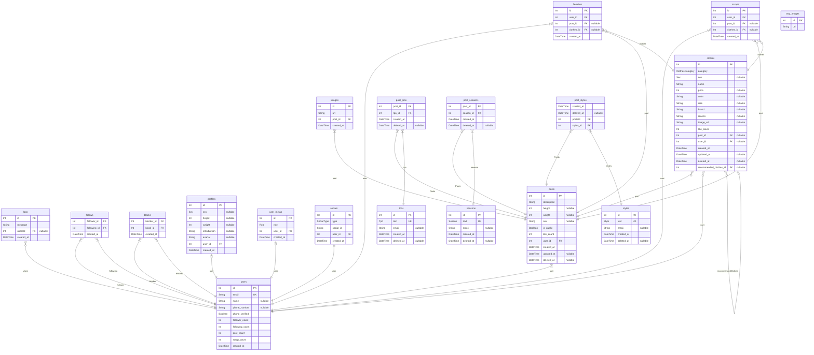

# Shopping Mall
> Generated by [`prisma-markdown`](https://github.com/samchon/prisma-markdown)

- [default](#default)

## default

### `logs`

**Properties**
  - `id`: 
  - `message`: 
  - `usersId`: 
  - `created_at`: 

### `users`

**Properties**
  - `id`: 
  - `email`: 
  - `name`: 
  - `phone_number`: 
  - `phone_verified`: 
  - `follower_count`: 
  - `following_count`: 
  - `post_count`: 
  - `scrap_count`: 
  - `created_at`: 

### `follows`

**Properties**
  - `follower_id`: 
  - `following_id`: 
  - `created_at`: 

### `blocks`

**Properties**
  - `blocker_id`: 
  - `block_id`: 
  - `created_at`: 

### `profiles`

**Properties**
  - `id`: 
  - `sex`: 
  - `height`: 
  - `weight`: 
  - `introduction`: 
  - `avartar`: 
  - `user_id`: 
  - `created_at`: 

### `user_metas`

**Properties**
  - `id`: 
  - `role`: 
  - `user_id`: 
  - `created_at`: 

### `socials`

**Properties**
  - `id`: 
  - `type`: 
  - `social_id`: 
  - `user_id`: 
  - `created_at`: 

### `posts`

**Properties**
  - `id`: 
  - `description`: 
  - `height`: 
  - `weight`: 
  - `sex`: 
  - `is_public`: 
  - `like_count`: 
  - `user_id`: 
  - `created_at`: 
  - `updated_at`: 
  - `deleted_at`: 

### `images`

**Properties**
  - `id`: 
  - `url`: 
  - `post_id`: 
  - `created_at`: 

### `clothes`

**Properties**
  - `id`: 
  - `category`: 
  - `sex`: 
  - `name`: 
  - `price`: 
  - `color`: 
  - `size`: 
  - `brand`: 
  - `reason`: 
  - `image_url`: 
  - `like_count`: 
  - `post_id`: 
  - `user_id`: 
  - `created_at`: 
  - `updated_at`: 
  - `deleted_at`: 
  - `recommended_clothes_id`: 

### `favorites`

**Properties**
  - `id`: 
  - `user_id`: 
  - `post_id`: 
  - `clothes_id`: 
  - `created_at`: 

### `scraps`

**Properties**
  - `id`: 
  - `user_id`: 
  - `post_id`: 
  - `clothes_id`: 
  - `created_at`: 

### `tpos`

**Properties**
  - `id`: 
  - `text`: 
  - `emoji`: 
  - `created_at`: 
  - `deleted_at`: 

### `post_tpos`

**Properties**
  - `post_id`: 
  - `tpo_id`: 
  - `created_at`: 
  - `deleted_at`: 

### `seasons`

**Properties**
  - `id`: 
  - `text`: 
  - `emoji`: 
  - `created_at`: 
  - `deleted_at`: 

### `post_seasons`

**Properties**
  - `post_id`: 
  - `season_id`: 
  - `created_at`: 
  - `deleted_at`: 

### `styles`

**Properties**
  - `id`: 
  - `text`: 
  - `emoji`: 
  - `created_at`: 
  - `deleted_at`: 

### `post_styles`

**Properties**
  - `created_at`: 
  - `deleted_at`: 
  - `postsId`: 
  - `styles_id`: 

### `tmp_images`

**Properties**
  - `id`: 
  - `url`: 